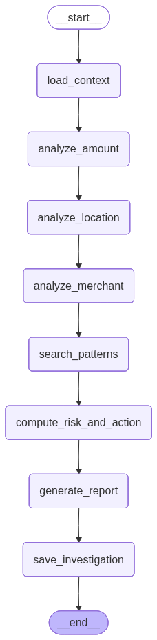
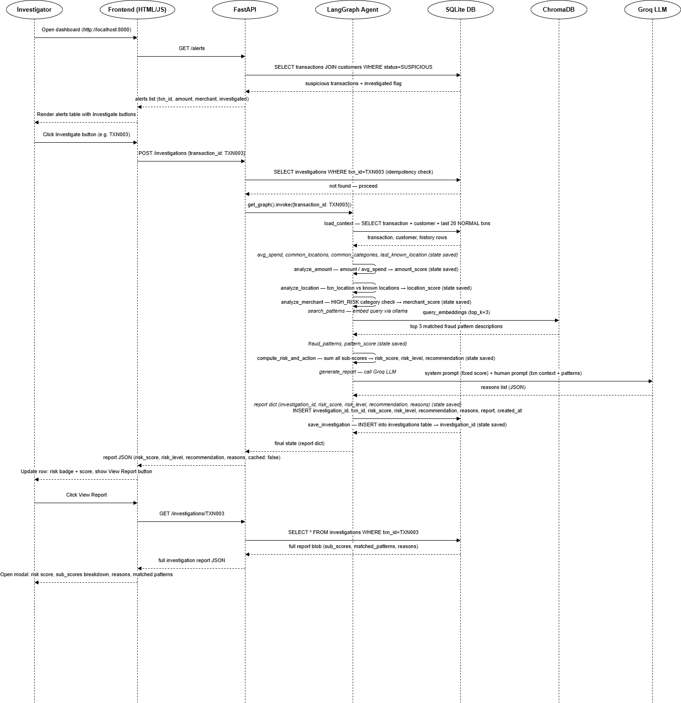
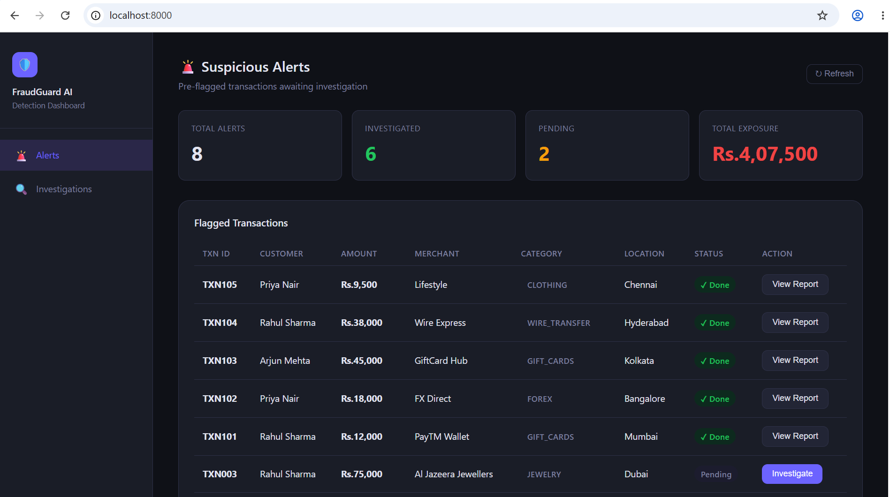
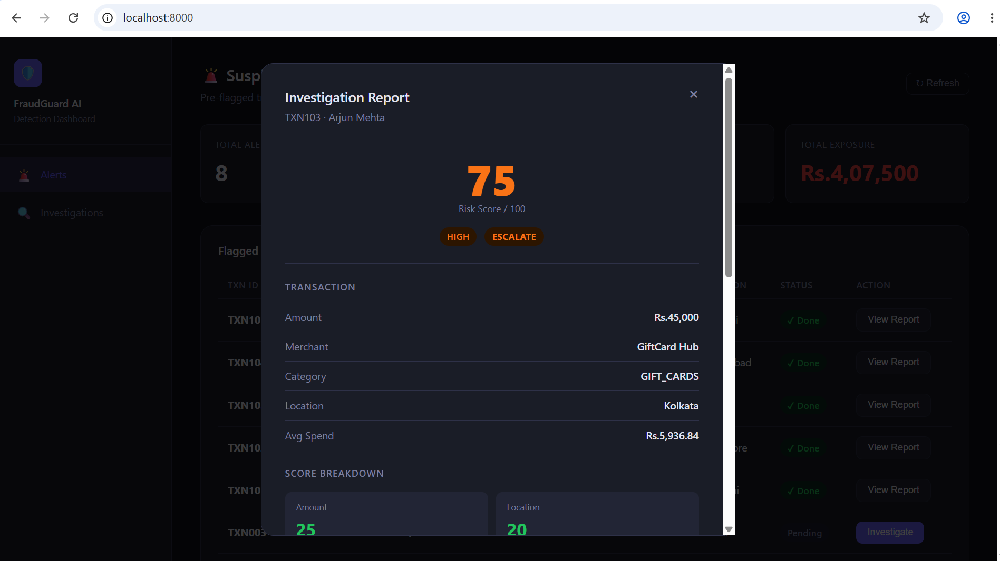
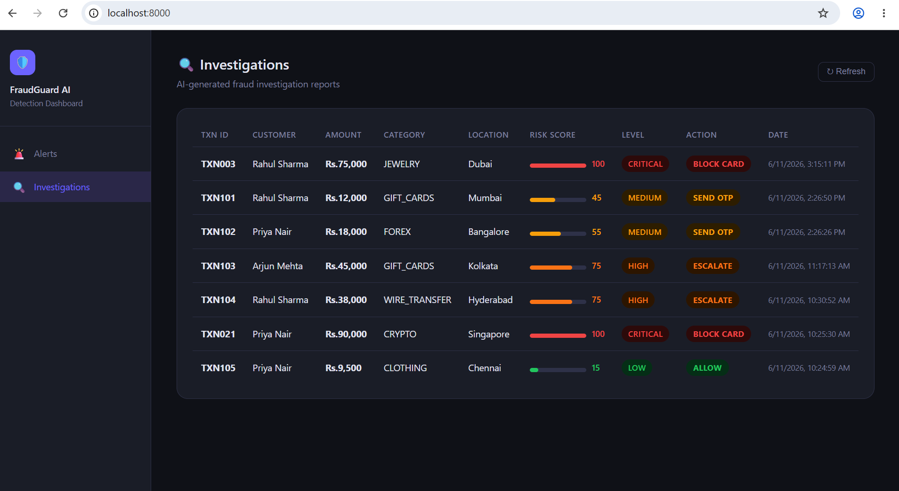

# AI-Powered Banking Fraud Detection Explainer Agent
### LangGraph + ChromaDB + Structured Output

**Author: Eby Mathew**

---

## Project Overview

An intelligent fraud alert explainer system for retail banking. When a suspicious transaction is detected, the LangGraph agent investigates it step by step — checking the transaction amount against the customer's spending history, verifying the merchant category risk, comparing the transaction location against the customer's last known location, and cross-referencing against a fraud pattern knowledge base (ChromaDB). The agent generates a structured fraud risk report with a risk score and recommended action (Block Card, Send OTP, Escalate, or Allow), saved to SQLite and surfaced via a FastAPI REST API and HTML dashboard.

---

## Agent Flow Graph

> Generated by running `python generate_graph.py`



---

## Sequence Diagram



---

## Screenshots

### Alerts Dashboard


### Investigation Report 


### Investigations Table


---

## Project Structure

```
fraud-detection/
│
├── agent/
│   ├── state.py                       # AgentState TypedDict
│   ├── graph.py                       # LangGraph pipeline builder
│   └── nodes/
│       ├── load_context.py            # Node 1: fetch transaction + customer + history
│       ├── analyze_amount.py          # Node 2: spend ratio → amount_score
│       ├── analyze_location.py        # Node 3: location comparison → location_score
│       ├── analyze_merchant.py        # Node 4: merchant category risk → merchant_score
│       ├── search_patterns.py         # Node 5: ChromaDB semantic search → pattern_score
│       ├── compute_risk_and_action.py # Node 6: sum scores → risk_level + recommendation
│       ├── generate_report.py         # Node 7: Groq LLM writes reasons list
│       └── save_investigation.py      # Node 8: persist report to SQLite
│
├── api/
│   └── routes.py                      # FastAPI endpoints (4 routes)
│
├── db/
│   ├── init_db.py                     # Create tables + seed customers + transactions
│   └── seed_chromadb.py               # Embed 15 fraud patterns into ChromaDB
│
├── static/
│   └── index.html                     # Dashboard UI (HTML + CSS + Vanilla JS)
│
├── docs/
│   ├── sequence_diagram.png
│   └── screenshots/
│       ├── alerts.png
│       ├── investigation_modal.png
│       └── investigations_table.png
│
├── app.py                             # FastAPI entry point
├── generate_graph.py                  # Generates graph.png
├── graph.png                          # Agent flow graph (auto-generated)
├── pyproject.toml                     # Dependencies
└── .env                               # API keys (not committed)
```

---

## Tech Stack

| Layer               | Technology                        |
|---------------------|-----------------------------------|
| Agent orchestration | LangGraph                         |
| LLM                 | llama-3.3-70b-versatile via Groq  |
| Vector store        | ChromaDB                          |
| Embeddings          | nomic-embed-text via Ollama local |
| Database            | SQLite                            |
| API layer           | FastAPI                           |
| Frontend            | HTML + CSS + Vanilla JS           |
| Language            | Python 3.11+                      |

---

## Key Design Decisions

- **Scoring & action logic are pure Python. LLM only narrates.** The `risk_score`, `risk_level`, and `recommendation` are computed deterministically — the LLM cannot override them.
- **ChromaDB as knowledge base.** 15 plain-English fraud pattern descriptions, embedded once at setup via Ollama local (nomic-embed-text).
- **Idempotency guard.** The POST `/investigations` endpoint checks the database before running the agent — returns cached result if the transaction was already investigated.
- **Node isolation.** `save_investigation` is separate from `generate_report` so LLM timeouts and DB failures fail independently.

---

## Risk Score Thresholds

| Score  | Risk Level | Recommendation |
|--------|------------|----------------|
| 0–30   | LOW        | ALLOW          |
| 31–55  | MEDIUM     | SEND_OTP       |
| 56–75  | HIGH       | ESCALATE       |
| 76–100 | CRITICAL   | BLOCK_CARD     |

---

## Setup & Running

### 1. Clone the repo and create virtual environment
```bash
git clone https://github.com/ebymathew2001/ai-fraud-detection-agent.git
cd ai-fraud-detection-agent
uv venv
source .venv/bin/activate        # Windows: .venv\Scripts\activate
uv sync
```

### 2. Add API keys to `.env`
```
GROQ_API_KEY=gsk_your_key_here
DATABASE_URL=fraud.db
CHROMA_PATH=./chroma_store
```

### 3. Pull the embedding model via Ollama
```bash
ollama pull nomic-embed-text
```

### 4. Initialize the database
```bash
python db/init_db.py
```

### 5. Seed ChromaDB with fraud patterns
```bash
python db/seed_chromadb.py
```

### 6. Start the server
```bash
python app.py
```

Dashboard → [http://localhost:8000](http://localhost:8000)  
API docs  → [http://localhost:8000/docs](http://localhost:8000/docs)

### 7. Generate agent flow graph
```bash
python generate_graph.py
```

---

## REST API

| Method | Endpoint                   | Description                                      |
|--------|----------------------------|--------------------------------------------------|
| GET    | `/alerts`                  | All SUSPICIOUS transactions + investigated flag  |
| POST   | `/investigations`          | Trigger investigation (returns cached if exists) |
| GET    | `/investigations/{txn_id}` | Fetch one saved investigation                    |
| GET    | `/investigations`          | Summary list of all investigations               |

---

## Sample Investigation Response

```json
{
  "investigation_id": "inv_7f3a2b",
  "txn_id": "TXN003",
  "risk_score": 85,
  "risk_level": "CRITICAL",
  "recommendation": "BLOCK_CARD",
  "reasons": [
    "Amount Rs.75000 is 14x the 20-transaction average of Rs.5300.",
    "Location Dubai is completely new — last known location was Mumbai.",
    "JEWELRY is in the high-risk merchant category list.",
    "Pattern match: high-value jewelry purchase at an unfamiliar foreign location."
  ],
  "cached": false
}
```

---

## Sample Data

### Customers

| ID      | Name         | Home City |
|---------|--------------|-----------|
| CUST001 | Rahul Sharma | Mumbai    |
| CUST002 | Priya Nair   | Chennai   |
| CUST003 | Arjun Mehta  | Delhi     |

### Suspicious Transactions

| TXN ID | Customer | Amount      | Merchant             | Category    | Location  |
|--------|----------|-------------|----------------------|-------------|-----------|
| TXN003 | CUST001  | Rs.75,000   | Al Jazeera Jewellers | JEWELRY     | Dubai     |
| TXN021 | CUST002  | Rs.90,000   | CryptoXchange        | CRYPTO      | Singapore |
| TXN047 | CUST003  | Rs.1,20,000 | Tech Galaxy          | ELECTRONICS | Hong Kong |